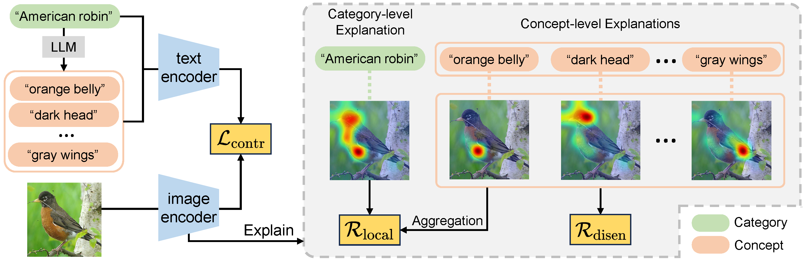

# DEAL: Disentangle and Localize Concept-level Explanations for VLMs (ECCV 2024, Strong Double Blind)

[[Paper](https://arxiv.org/pdf/2407.14412)] [[Code](https://github.com/tangli-udel/DEAL)] [[Video](https://www.youtube.com/watch?v=Rd4vFWI2fKw)] [[DeepREAL Lab](https://deep-real.github.io/)]

This repository holds the Pytorch implementation of **DEAL** in [DEAL: Disentangle and Localize Concept-level Explanations for VLMs](https://arxiv.org/pdf/2407.14412) by Tang Li, Mengmeng Ma, and Xi Peng.
If you find our code useful in your research, please consider citing:

```
@inproceedings{li2024deal,
 title={DEAL: Disentangle and Localize Concept-level Explanations for VLMs},
 author={Li, Tang and Ma, Mengmeng and Peng, Xi},
 booktitle={Proceedings of the European Conference on Computer Vision (ECCV)},
 year={2024}
}
```

## Introduction

Can we trust Vision-language Models (VLMs) in their predictions?
Our findings say NO! The fine-grained visual evidence behind their predictions could be wrong!
Our empirical results indicate that CLIP cannot disentangle and localize fine-grained visual evidence.
And this phenomenon can be observed in many popular VLMs across different benchmark datasets.
However, this issue is challenging to solve.
First, human annotations are missing for fine-grained visual evidence.
Second, existing VLMs align image with the entire textual caption, without disentangling and localizing fine-grained visual evidence.
To this end, we proposed to Disentangle and Localize (DEAL) concept-level explanations of VLMs without rely on expensive human annotations.



Quick start for the training:

```
sh run.sh
```
