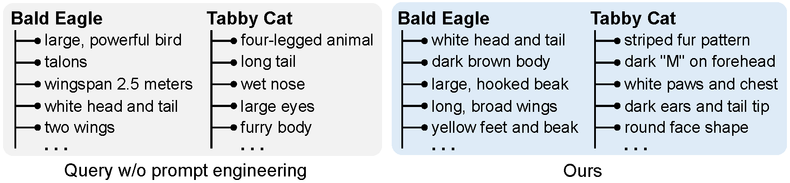
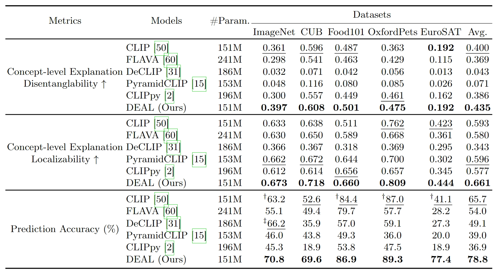

# DEAL: Disentangle and Localize Concept-level Explanations for VLMs (ECCV 2024, Strong Double Blind)

[[Paper](https://www.ecva.net/papers/eccv_2024/papers_ECCV/papers/05615.pdf)] [[Code](https://github.com/tangli-udel/DEAL)] [[Video](https://www.youtube.com/watch?v=Rd4vFWI2fKw)] [[DeepREAL Lab](https://deep-real.github.io/)]

This repository holds the Pytorch implementation of **DEAL** in [DEAL: Disentangle and Localize Concept-level Explanations for VLMs](https://arxiv.org/pdf/2407.14412) by Tang Li, Mengmeng Ma, and Xi Peng.
If you find our code useful in your research, please consider citing:

```
@inproceedings{li2024deal,
 title={DEAL: Disentangle and Localize Concept-level Explanations for VLMs},
 author={Li, Tang and Ma, Mengmeng and Peng, Xi},
 booktitle={Proceedings of the European Conference on Computer Vision (ECCV)},
 year={2024}
}
```

## Introduction

Can we trust Vision-language Models (VLMs) in their predictions?
Our findings say NO! The fine-grained visual evidence behind their predictions could be wrong!
Our empirical results indicate that CLIP cannot disentangle and localize fine-grained visual evidence.
And this phenomenon can be observed in many popular VLMs across different benchmark datasets.
However, this issue is challenging to solve.
First, human annotations are missing for fine-grained visual evidence.
Second, existing VLMs align image with the entire textual caption, without disentangling and localizing fine-grained visual evidence.
To this end, we proposed to Disentangle and Localize (DEAL) concept-level explanations of VLMs without rely on expensive human annotations.


## Pretrained Weights
- Fine-tuned on ImageNet: [DEAL-Openai-CLIP-RN50](https://drive.google.com/file/d/1Th_WQ0aPhnmqQ_uv7GJKv9vLyApcfaic/view?usp=sharing), [DEAL-Openai-CLIP-ViT-B/32](https://drive.google.com/file/d/1SoL-nNG4AgQ2V2Q39M2KX5bqWx95CaA0/view?usp=sharing)


## Datasets and Requirements

This repository reproduces our results on [ImageNet](https://www.image-net.org/download.php), [CUB](https://www.vision.caltech.edu/datasets/cub_200_2011/), [EuroSAT](https://zenodo.org/records/7711810#.ZAm3k-zMKEA), [OxfordPets](https://www.robots.ox.ac.uk/~vgg/data/pets/), and [Food101](https://data.vision.ee.ethz.ch/cvl/datasets_extra/food-101/) datasets, please download these datasets as needed. Our code is build upon Python3 and Pytorch v2.0.1 on Ubuntu 18.04. Please install all required packages by running:

```
pip install -r requirements.txt
```

## Generating Concepts for Categories


You will need to add your [OpenAI API](https://platform.openai.com/docs/api-reference/introduction) token and run the following notebook. Note that in notebook showcase our best prompt for *this task*, you can change to any category list as you want or modify the prompts as needed.
```
./deal/generate_descriptors.ipynb
```
OpenAI will update their API library, please modify the code accordingly if needed.


## Training

Before training, please replace the paths in [load.py](https://github.com/tangli-udel/DEAL/blob/3d31d67638395af9dda938017882f73088105a99/load.py#L81) to your own datasets.

```
python train.py --dataset imagenet --model ViT-B/32 --batch_size 256 --lr 5e-7 --save_path "/path/to/save/"
```

## Evaluations
The results for prediction accuracy and explanation quality:


To evaluate the prediction accuracy, please run:
```
./deal/evaluation.ipynb
```

To evaluate concept-level explanation disentanglability, please run:
```
./deal/exp_disentanglability.ipynb
```

To evaluate concept-level explanation localzability (fidelity), please run:
```
./deal/exp_localizability.ipynb
```


## Acknowledgement
Part of our code is borrowed from the following repositories.

- [Visual Classification via Description from Large Language Models](https://github.com/sachit-menon/classify_by_description_release)
- [Generic Attention-model Explainability for Interpreting Bi-Modal and Encoder-Decoder Transformers](https://github.com/hila-chefer/Transformer-MM-Explainability)

We thank to the authors for releasing their codes. Please also consider citing their works.